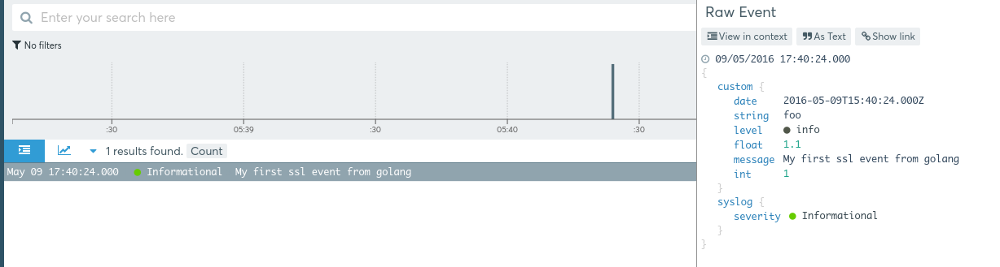

# logmatic-go
Link to the Logmatic.io documentation: http://doc.logmatic.io/docs/

Go helpers to send logs to Logmatic.io based on [http://github.com/Sirupsen/logrus](Logrus lib).

It mainly contains a proper JSON formatter and a TLS socket handler that streams logs directly to Logmatic.io - so no need to use a log shipper if you don't wan't to.

## Usage

### Use the JSON formatter

To use the JSON formatter, simply associate it.


```go
package main

import (
  log "github.com/Sirupsen/logrus"
  "github.com/logmatic/logmatic-go"
)

func main() {
  
	// use JSONFormatter
  	log.SetFormatter(&logmatic.JSONFormatter{})
  	  
	// log an event as usual with logrus
 	log.WithFields(log.Fields{"string": "foo", "int": 1, "float": 1.1 }).Info("My first event from golang to stdout")
}
```
You should able to see on the console the following output.
```json
{"date":"2016-05-10T15:48:47+02:00","float":1.1,"int":1,"level":"info","message":"My first ssl event from golang to stdout","string":"foo"}
```


### Stream log straight to Logmatic.io
The Logrus can be coupled to the LogmaticHook as follow:

```go
	// instantiate a new Logger with your Logmatic APIKey
  	log.AddHook(logmatic.NewLogmaticHook("<YOUR_API_KEY>"))
  
	//Don't forget to replace by the one provided on your Logmatic.io's platform.
	// log an event as usual with logrus
 	log.WithFields(log.Fields{"string": "foo", "int": 1, "float": 1.1 }).Info("My second event from golang to Logmatic")
  
}
```
With this configuration, any log coming from your Go's application will be sent to your platform and will fulfill the same format as described in the previous section.




Please contact us if you want anything more to be added in this toolset!
